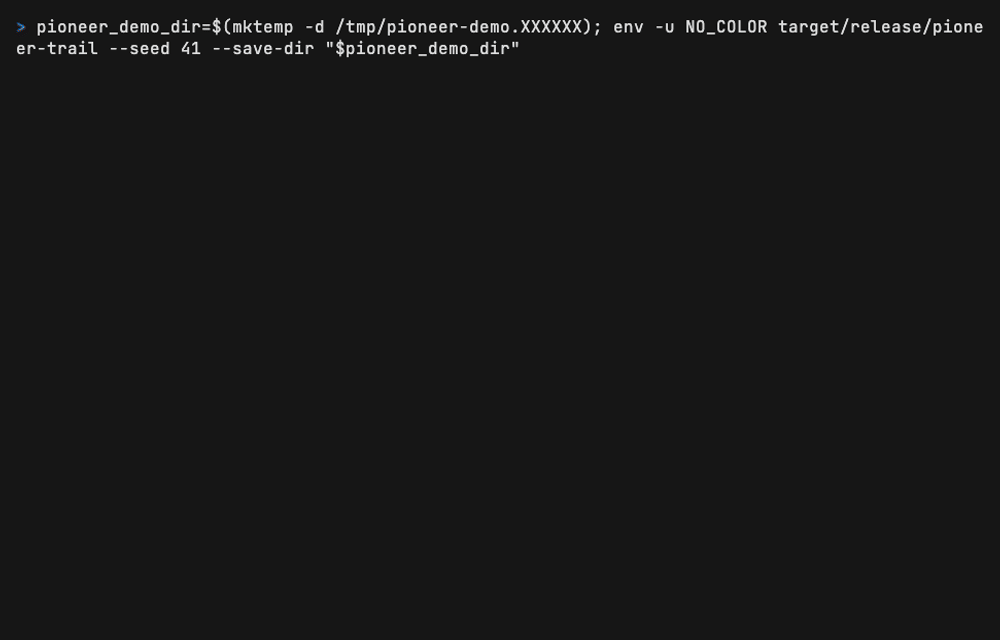

<p align="center"></p>

# Pioneer Trail

A keyboard-only terminal journey game. Outfit a wagon in Independence, travel west with a party,
and manage supplies, weather, illness, rivers, events, and hard choices.



## Play

On macOS or Linux with Homebrew:

```bash
brew install contractorkeith/tap/pioneer-trail
pioneer-trail
```

Or download a binary for macOS, Linux, or Windows from
[GitHub Releases](https://github.com/ContractorKeith/pioneer-trail/releases/latest).
For your first journey, try Banker, March, Oregon, 1848. Crates.io publication is still pending;
the Homebrew formula builds directly from the released source.

First trip? Press `?` in the store for budget-aware buying advice. Check the selected item's unit
and total price before buying. Trail tips explain food and health risks, and automatic travel
pauses when your party needs attention. See [first-journey improvements](docs/features/first-journey/README.md).

## What's new in v0.2.0

This update adds a no-cost `c` camp screen,
gathering previews for quick one-day or longer three-day searches, named conversations, skippable
travel moments, a visited-route map, a persistent journal, and optional sealed letters. See
[Playing](docs/PLAYING.md) for the controls and save notes.

## Play from source

Install a current Rust toolchain, clone this repository, then run:

```bash
cargo run --release -p pioneer-trail
```

To install the local binary into your Cargo bin directory:

```bash
cargo install --path crates/tui
pioneer-trail
```

The title screen starts a new journey or resumes a save. Use `--continue` to open the most recent
save directly. See [Playing](docs/PLAYING.md) for the full controls and save behavior.

## Useful commands

```bash
# Repeat a journey from a known seed.
cargo run --release -p pioneer-trail -- --seed 42

# Start with a particular setup.
cargo run --release -p pioneer-trail -- --occupation banker --month march --trail oregon --era 1848

# Keep saves separate while testing.
cargo run --release -p pioneer-trail -- --save-dir ./pioneer-save-test

# Use text-only scenes and turn-based minigames.
cargo run --release -p pioneer-trail -- --no-art

# Run simulated journeys without opening the terminal interface.
cargo run --release -p pioneer-trail -- --headless-sim 100 --seed 42
```

`--month` accepts `march` through `july` or `3` through `7`. `--no-art`, `--mono`, and a nonempty
`NO_COLOR` environment variable support terminals where pixel scenes or color are not useful.

## What is in the game

- Character setup, wagon shopping, pace and ration choices, travel, rest, and treatment.
- Weather, terrain, river crossings, forts, prices, and three routes across several eras.
- Data-driven trail events, ailments, morale, party relationships, and a local hall of fame.
- Hunting and rafting minigames, with text controls available through `--no-art`.
- Seeded runs, autosaves, local settings, and resumable journeys.
- Camps, gathering results, named conversations, route records, journals, travel moments, and sealed letters.

Read [the player guide](docs/PLAYING.md) before your first trip. [Build status](docs/BUILD_STATUS.md)
maps the current implementation to the original plan and records deliberate limits. The original
[design and phase plan](docs/PLAN.md) remains the project roadmap.

See [release acceptance](docs/RELEASE_ACCEPTANCE.md) for v0.1.0 verification and known limits.
